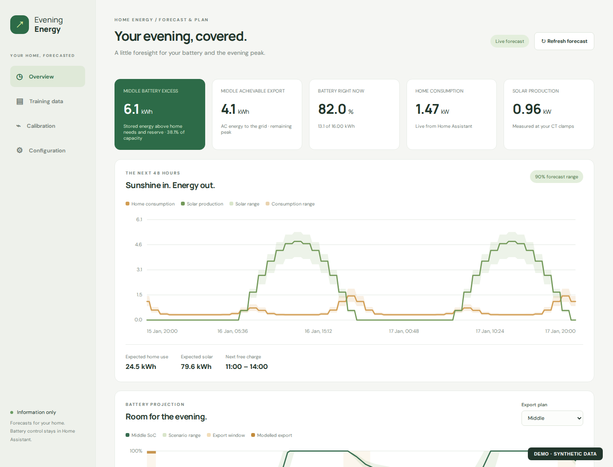
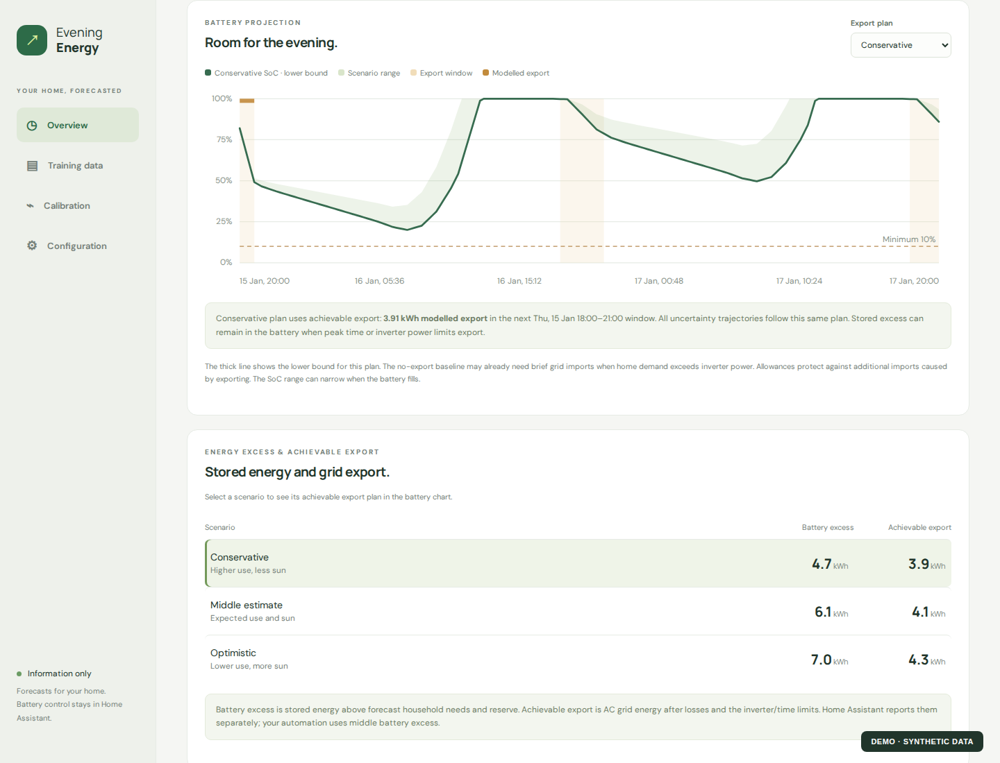
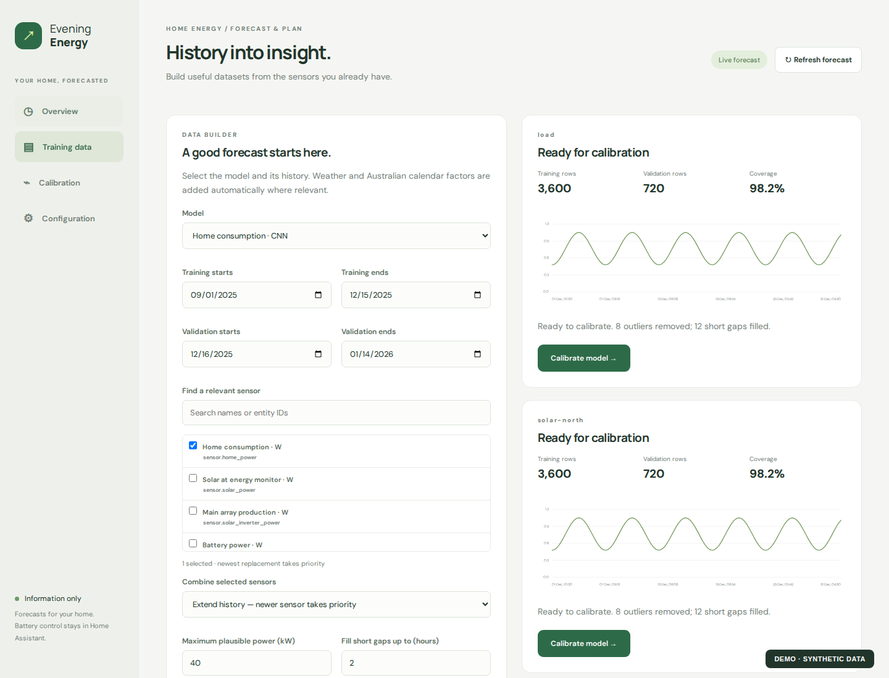
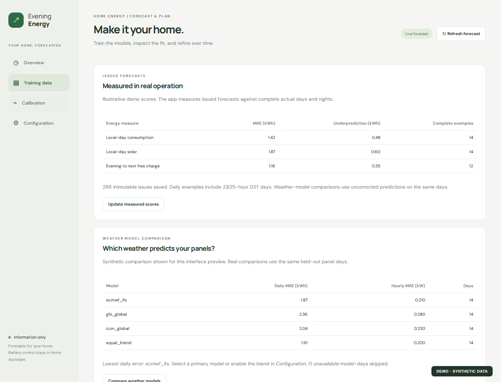

# Evening Energy

**Know what your home will need—and what your battery can spare.**

[](https://github.com/funkmaster-dan/evening-energy/releases)
[](https://www.python.org/)
[](LICENSE)

Evening Energy combines Home Assistant data, weather forecasts and models trained on your own home to forecast consumption, solar production and battery state of charge. It separates **stored battery excess** from **achievable grid export**, so you can see both the energy budget and the practical limits of an evening tariff window.

Built for local home use, with Australian calendar features and a simple web interface. The app provides information only: **it never controls your battery**.



*Screenshots use synthetic demonstration data at the app’s real hourly power-forecast resolution, not a real household.*

## What it does

- **Forecasts home consumption** with a CNN using weather, calendar patterns and recent/weekly load context.
- **Forecasts solar generation** with a separate LightGBM model for each panel orientation, plus a fading correction from recent measured production.
- **Projects battery SoC** using calibrated efficiencies, inverter limits, minimum SoC, an extra reserve and scheduled grid charging.
- **Shows uncertainty** with conservative, middle and optimistic plans, aligned charts and shared hover tooltips.
- **Measures forecasts as issued**, comparing later actual daily and overnight energy with the weather information available at the time.
- **Reports to Home Assistant** through the separate, read-only [Energy Excess HACS integration](https://github.com/funkmaster-dan/ha-energy-excess).

Everything is configured in the normal **Configuration**, **Training data** and **Calibration** panels. No setup wizard or JSON editing is required.

## Excess is not achievable export

| Metric | What it means |
| --- | --- |
| **Battery excess** | Stored battery energy above forecast household needs and the configured minimum/reserve. It is not capped by the export window's duration or inverter export power. |
| **Achievable export** | AC energy deliverable to the grid in the current or next peak window, after discharge losses and inverter/time limits. It can include charging forecast before a future peak. |

The battery chart models the **achievable export** plan. Its thick line follows the lower bound for **Conservative**, the middle estimate for **Middle**, and the upper bound for **Optimistic**. **No export** shows the middle projection without exporting. The complete scenario range remains visible. Load and solar power forecasts are hourly; the battery simulation uses 15-minute intervals, so repeated power values within each hour are expected.

A morning SoC above the configured minimum can be correct: export may be limited by time, inverter power, reserve, or a later low point in the forecast horizon.



## Quick start with Docker

You need Docker with Compose, a reachable Home Assistant instance, and internet access for weather/calendar data and the initial image build.

```bash
git clone https://github.com/funkmaster-dan/evening-energy.git
cd evening-energy
docker compose up -d --build
```

Open **[http://localhost:8099](http://localhost:8099)**. If Docker runs on another computer, use that computer's address instead of `localhost`.

The first build downloads CPU PyTorch and the other model dependencies. Settings, credentials, cached history, datasets and trained models stay in the local `data/` directory, mounted into the container. No training data or pretrained household models are included.

### Configure your home

1. In Home Assistant, create a **long-lived access token** from your user profile.
2. In **Configuration**, enter the HA URL/token, save, and check the connection.
3. Select your consumption, solar, battery power and battery SoC entities. Power sensors should report **W or kW**; SoC should report **%**.
4. Set your location, timezone and Australian state, battery capacity/limits, minimum SoC, reserve, charging windows and export tariff times.
5. Add your solar panel banks and set their tilt/azimuth. Capacity and conversion efficiency are inferred during calibration.

Defaults are examples, not a description of your home or tariff. Replace the example sensor IDs and settings before building datasets. Existing installations retain their saved configuration.

### Build and calibrate

1. Open **Training data** and choose a model and recorded sensors.
2. Select separate training and validation periods, then build the dataset. The app shows coverage, filtered values, short-gap filling and readiness.
3. Open **Calibration** and train the consumption model and each solar bank. Calibrate battery efficiencies and the inverter-to-monitoring conversion as well.
4. Return to **Overview** and refresh the forecast.

The consumption model needs at least seven training days and ten validation days. Several weeks is a useful starting point; longer histories provide more seasonal context. Battery calibration needs both charging and discharging with changing SoC, and the correct battery capacity. Use recent validation dates when archived-weather backtesting is enabled; unavailable forecast runs are skipped.



## Home Assistant reporting

Install [Energy Excess](https://github.com/funkmaster-dan/ha-energy-excess) through HACS, then add the integration using the URL of your Evening Energy app.

It exposes twelve derived sensors: low/middle/high **battery excess** and **achievable export**, each in kWh and battery percentage. Existing excess sensors represent stored battery energy; achievable-export sensors represent AC grid energy. Their attributes identify the energy basis and forecast readiness.

Unavailable inputs or incomplete calibration produce zero estimates. An expired forecast or unreachable app makes HA sensors unavailable. Unchanged readings—such as 100% SoC or zero generation at night—remain valid while HA reports them available.

Battery control is separate. An optional [minimal export automation](home_assistant/README.md) illustrates using positive excess during a chosen window with the [AlphaESS Portal Export](https://github.com/funkmaster-dan/ha-alphaess-portal) controller. Other batteries can use their own HA integrations and automations.

## Training and forecast tools

- **Age weighting and history replay:** keep recent data influential while retaining seasonal examples.
- **Guarded updates and rollback:** train candidates separately and compare independent daily/multi-day and overnight energy errors before promotion.
- **Weather comparison:** compare ECMWF, GFS, ICON and a blend against the same held-out panel data.
- **Direct CNN trial:** compare a 24-hour output model with the active recursive model; retain it only if promotion checks pass.
- **Known loads:** add appliance power/state inputs or recurring local-clock schedules for loads such as HVAC, EV charging, pumps or hot water.
- **Issued-forecast scores:** accumulate complete measured days/nights without counting frequent refreshes as independent examples.



## Updating

```bash
git pull
docker compose up -d --build
```

Your `data/` volume is preserved. Back it up before changing machines or deleting it; it contains your configuration and learned models. Do not commit it to Git.

## Run without Docker

Use Python **3.12**:

```bash
python -m venv .venv
source .venv/bin/activate
pip install -r requirements.txt
pip install torch --index-url https://download.pytorch.org/whl/cpu
uvicorn app.main:app --host 0.0.0.0 --port 8099
```

Set `ENERGY_DATA_DIR` to use another directory for private app data. The default is `data/`.

## Scope and limitations

This is an experimental home project. Forecast bands are empirical scenarios, not guaranteed coverage, and model quality depends on your sensor history and installation. Known charging schedules are assumptions; your external automations must actually follow them. The app also cannot remove physical inverter limits.

Use it on a **trusted private network**. The app has no user authentication, and its HA token is stored in the local data directory. Keep that directory private and do not expose the service directly to the internet.

Weather comes from [Open-Meteo](https://open-meteo.com/). Solar geometry uses [pvlib](https://pvlib-python.readthedocs.io/). Australian calendar inputs use [python-holidays](https://holidays.readthedocs.io/) and [AustralianHolidays state school calendars](https://github.com/pmcau/AustralianHolidays), with bundled public South Australian historical dates. Training and forecasting run on the CPU.

## License

[MIT](LICENSE). See the [changelog](CHANGELOG.md) for release notes.
